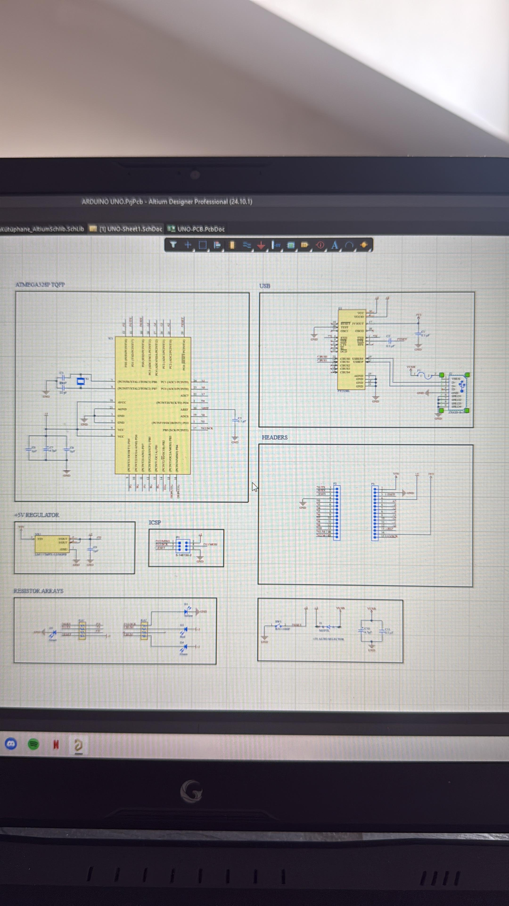
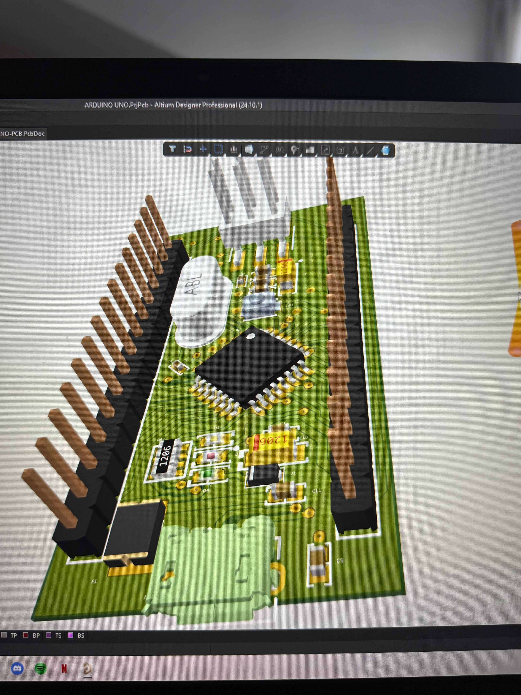
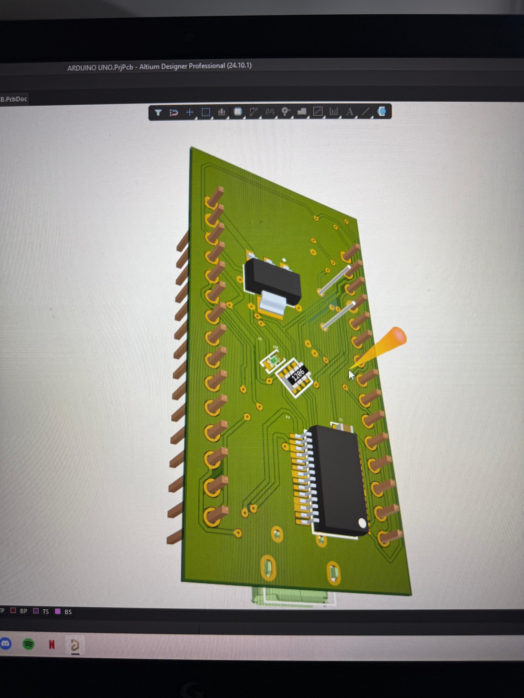

# Arduino Nano PCB Design

This project is a PCB design of the Arduino Nano development board.

## Features

- ATmega328P microcontroller
- Arduino Nano compatible pinout
- SMD  components
- USB to Serial interface
- 5V voltage regulation

## Design Goals

- Understand the internal architecture of Arduino Nano
- Practice PCB layout techniques for small boards
- Learn component placement strategy for compact designs
- Improve hands-on design skills using Altium Designer

## Tools Used

- Altium Designer
- ATmega328P datasheet
- Arduino Nano reference schematic

## Images

