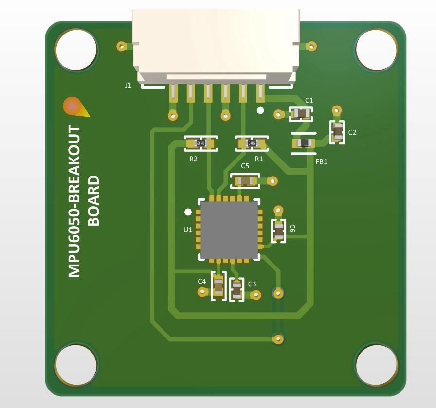
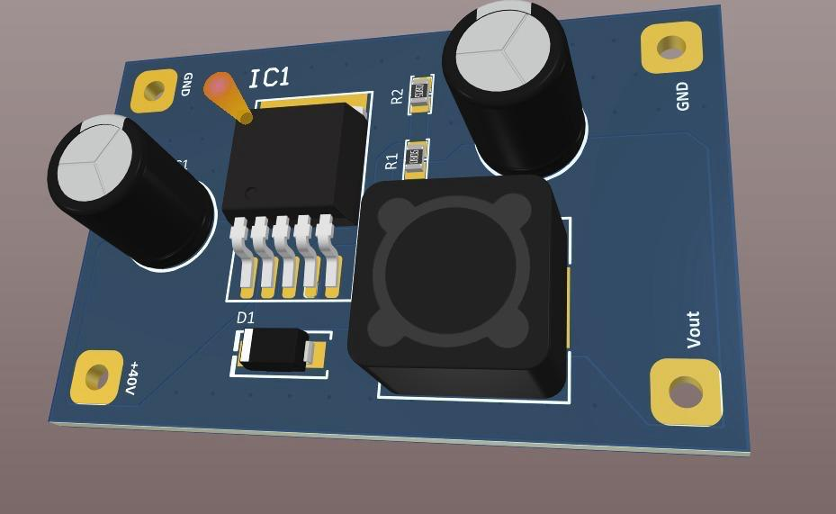
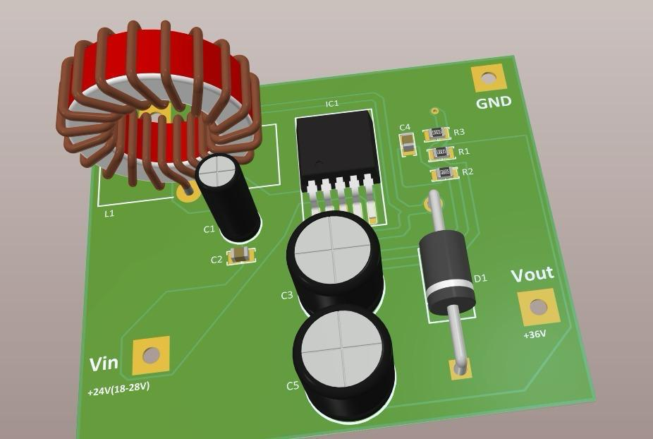
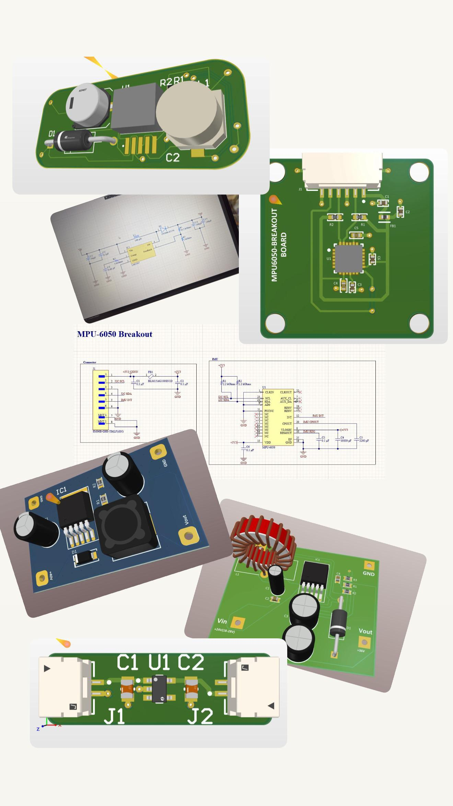
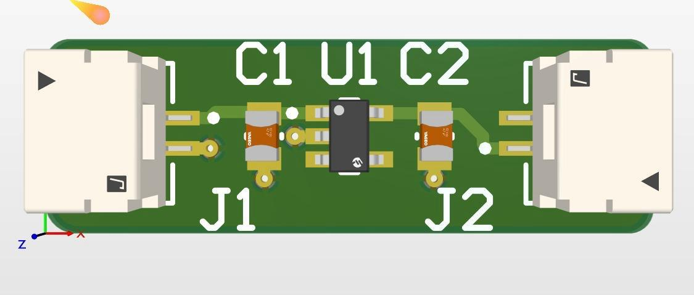

# Basic PCB Circuit Designs

This directory contains small PCB projects created to practice fundamental PCB design principles.

## Focus Areas

- Component placement strategies
- Signal routing techniques
- Power and ground plane layout
- Understanding PCB design rules
- Developing hands-on skills in Altium Designer

## Tools Used

- Altium Designer
- PCB Toolkit V8.40

## Images

