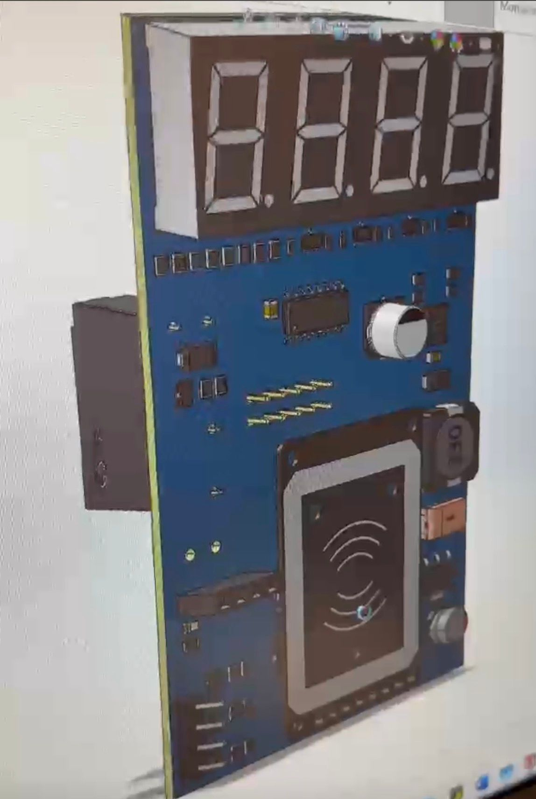
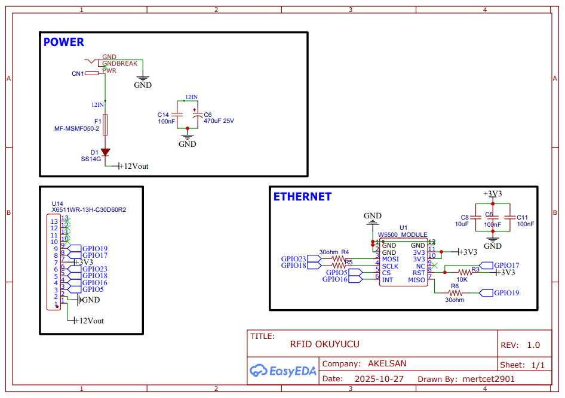
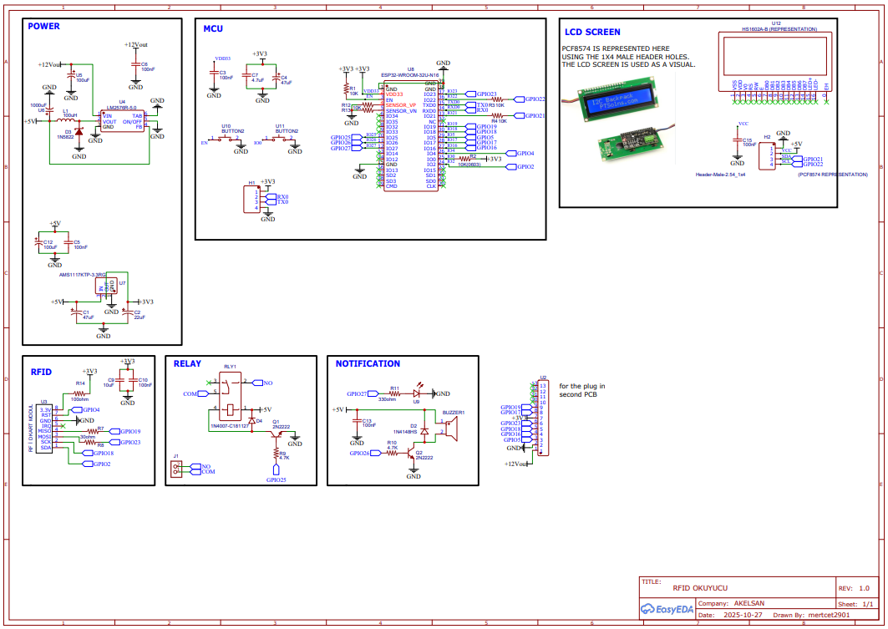

# ESP32-Based RFID Control System

> Designed and developed during my internship as a hardware design task requested by the company.

This project involves the design of an **ESP32-based RFID control system**. The system integrates RFID card reading, user notification, relay control, and status display via an LCD into a single embedded hardware architecture.

The project was **designed and developed by me during my internship at Akelsan Teknik Güvenlik Sistemleri ve Yönetim Danışmanlığı Tic. Ltd. Şti.**, based on a system requirement requested by the company.

Within the scope of the project, power management, microcontroller interfacing, RFID communication, LCD integration, relay driver circuitry, and audio/visual notification structures were designed and implemented together.

---

# Project Overview

This design provides an embedded system infrastructure capable of processing RFID card or tag readings, giving feedback to the user through display and notification components, and controlling an external load through a relay output when required.

The system architecture is suitable for applications such as:

- Access control systems  
- Card-based entry systems  
- Smart lock systems  
- RFID-based authorization systems  
- Embedded automation solutions  

---

# Hardware Specifications

| Component | Model | Description |
|-----------|------|-------------|
| Microcontroller | ESP32-WROOM-32U-N16 | Main system controller |
| RFID Reader | MFRC522 | RFID card communication via SPI |
| Display | 16x2 LCD + PCF8574 | I2C user interface display |
| Relay | 5V Relay | External load switching |
| Relay Driver | 2N2222 | Transistor relay driver |
| Buzzer | Active Buzzer | Audio notification |
| Voltage Regulator | LM2576-5.0 | 12V to 5V switching regulator |
| Voltage Regulator | AMS1117-3.3 | 5V to 3.3V linear regulator |
| Protection Diode | 1N4007 | Relay protection |
| Flyback Diode | 1N4148 | Buzzer protection |

---

# ESP32 Pin Connections

| ESP32 Pin | Connected Device | Function |
|----------|------------------|----------|
| GPIO23 | MFRC522 MOSI | SPI Data |
| GPIO19 | MFRC522 MISO | SPI Data |
| GPIO18 | MFRC522 SCK | SPI Clock |
| GPIO5 | MFRC522 SDA (SS) | Chip Select |
| GPIO17 | MFRC522 RST | RFID Reset |
| GPIO21 | LCD SDA | I2C Data |
| GPIO22 | LCD SCL | I2C Clock |
| GPIO25 | Relay Driver (2N2222) | Relay Control |
| GPIO26 | Buzzer Driver | Audio Notification |
| GPIO27 | Status LED | Visual Notification |

---

# Power Architecture

| Input | Output | Method |
|------|-------|--------|
| 12V Input | 5V | LM2576 Switching Regulator |
| 5V | 3.3V | AMS1117 Linear Regulator |

---

# System Architecture

```
          +12V Input
              |
      +----------------+
      | LM2576 (5V)    |
      +----------------+
              |
      +----------------+
      | AMS1117 (3.3V) |
      +----------------+
              |
            ESP32
      +--------+--------+
      |        |        |
    RFID      LCD     Relay
    (SPI)     (I2C)    Driver
      |                 |
    MFRC522           2N2222
                        |
                      Relay
                        |
                      Load
              
         +--------+        +--------+
         | Buzzer |        |  LED   |
         +--------+        +--------+
            GPIO26            GPIO27
```

---

# Notification System

The system provides both **visual and audible feedback** to the user.

- **Buzzer (GPIO26)** provides audio alerts.
- **Status LED (GPIO27)** provides visual system feedback.

These indicators can signal events such as:

- Successful card reading
- Access granted
- Access denied
- Insufficient balance
- System status notifications

---

# Technical Scope

The project focuses on the following technical aspects:

- Creating multiple voltage rails from a 12V input supply  
- Designing proper power and peripheral connections for ESP32  
- Integrating RFID communication lines with the microcontroller  
- Implementing an I2C-based LCD interface  
- Designing a transistor-based relay driver with protection diode  
- Creating user feedback infrastructure using buzzer and LED indicators  
- Organizing schematics using a modular block-based design approach  

---

# Application Areas

This system architecture can be used in:

- Card-based access control systems  
- Smart lock systems  
- Authorization and security systems  
- Embedded automation systems  
- RFID-based authentication projects  

---

# Project Images

## Main Schematic





## PCB


---

# Possible Future Improvements

The project can be extended in several ways:

- Completing the PCB design and preparing it for manufacturing  
- Designing an external enclosure  
- Implementing an authorized / unauthorized card database  
- Adding Wi-Fi or Bluetooth-based remote management  
- Implementing system logging functionality  
- Integrating door locks or magnetic locks  
- Adding a Real-Time Clock (RTC) module  
- Developing a mobile application or web interface for system control  

---

# Conclusion

This project presents a modular embedded system design that integrates the fundamental hardware blocks required for RFID-based control systems.

By combining power electronics, microcontroller interfacing, communication interfaces, user notification components, and relay control within a single architecture, the project represents a comprehensive applied engineering implementation.
